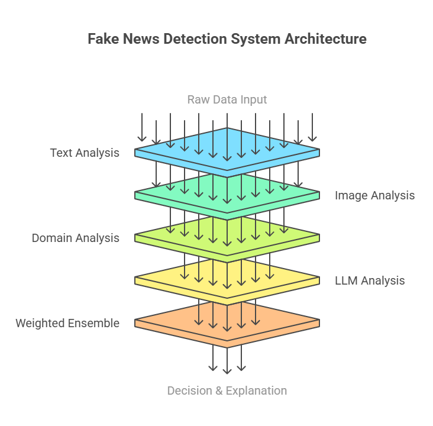
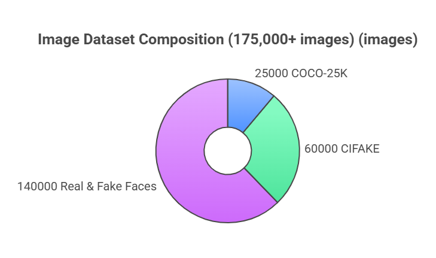

# NewsXpose: Advanced Fake News Detection System

<div align="center">
  
*A comprehensive multi-modal system for detecting fake news across text, images, and videos*
  
[](https://www.python.org/)
[](https://www.tensorflow.org/)
[](https://streamlit.io/)
[](https://scikit-learn.org/)
  
</div>

## 📋 Table of Contents
- [Project Overview](#-project-overview)
- [Key Features](#-key-features)
- [System Architecture](#-system-architecture)
- [Datasets](#-datasets)
- [Models & Algorithms](#-models--algorithms)
- [Performance Metrics](#-performance-metrics)
- [Demo](#-demo)
- [What Makes NewsXpose Different](#-what-makes-newsxpose-different)
- [Future Directions](#-future-directions)
- [Contributors](#-contributors)
- [License](#-license)

## 🌟 Project Overview

NewsXpose is a state-of-the-art fake news detection system that combines multiple analysis techniques to determine the authenticity of news articles, social media posts, and YouTube videos. The system uses an ensemble of machine learning models, image analysis, domain credibility checking, and LLM-based content analysis to provide a holistic assessment of content authenticity.

<div align="center">
  

  
*High-level overview of the NewsXpose detection system*
  
</div>

## 🚀 Key Features

- **Multi-modal Analysis**: Combines text, image, domain, and LLM analysis
- **Article Scraping**: Automatically extracts content from news websites and YouTube videos
- **Image Authenticity Detection**: Identifies AI-generated or manipulated images
- **Domain Credibility Assessment**: Evaluates the trustworthiness of source domains
- **Related Article Search**: Finds related articles to cross-reference information
- **Interactive Visualization**: Provides detailed breakdown of detection results
- **User-friendly Interface**: Built with Streamlit for easy interaction

## 🏗️ System Architecture

<div align="center">
  

  
*Detailed architecture of the NewsXpose detection system*
  
</div>

The system follows a weighted ensemble approach:
- **Text Analysis**: 50% weight
- **Image Analysis**: 15% weight
- **Domain Analysis**: 15% weight
- **LLM Analysis**: 20% weight

These weights were determined through extensive testing to optimize overall accuracy.

<div align="center">
  

  
*Flow diagram of the NewsXpose detection process*
  
</div>

## 📊 Datasets

### Text Dataset: WELFake

The WELFake dataset is a combination of four datasets:
- Kaggle's Fake News dataset
- McIntire's Fake News dataset
- Reuters.com dataset
- BuzzFeed Political News dataset

**Dataset Statistics**:
- Total articles: 72,134
- Real news articles: 35,028
- Fake news articles: 37,106
- Features: title, text, subject, date

### Image Dataset

Our image dataset is a comprehensive collection from multiple sources, totaling over 175,000 images:

1. **COCO-25K** (25,000 images)
   - Source: [Kaggle COCO-25K Dataset](https://www.kaggle.com/datasets/trungit/coco25k/data)
   - Contains real-world images across 80 object categories
   - Used for training the model to recognize authentic photographic patterns

2. **CIFAKE** (60,000 images)
   - Source: [Kaggle CIFAKE Dataset](https://www.kaggle.com/datasets/birdy654/cifake-real-and-ai-generated-synthetic-images)
   - Contains 30,000 AI-generated images and 30,000 real images
   - Resolution: 32x32 pixels
   - Used for training the model to distinguish between real and AI-generated images

3. **Real and Fake Faces** (140,000 images)
   - Source: [Kaggle 140K Real and Fake Faces](https://www.kaggle.com/datasets/xhlulu/140k-real-and-fake-faces)
   - Contains 70,000 real face images and 70,000 AI-generated face images
   - Used specifically for training the model to detect fake human faces, which are common in fake news

<div align="center">

```
┌───────────────────────────────────────────────────────────────┐
│                                                               │
│                      Dataset Composition                      │
│                                                               │
│  ┌───────────────┐  ┌───────────────┐  ┌───────────────────┐  │
│  │               │  │               │  │                   │  │
│  │   COCO-25K    │  │    CIFAKE     │  │  Real & Fake      │  │
│  │  (25,000 img) │  │ (60,000 img)  │  │  Faces (140K img) │  │
│  │               │  │               │  │                   │  │
│  └───────────────┘  └───────────────┘  └───────────────────┘  │
│                                                               │
│  Total: 175,000+ images for training and validation           │
│                                                               │
└───────────────────────────────────────────────────────────────┘
```

*Composition of the image dataset used for training*
  
</div>

## 🧠 Models & Algorithms

### Text Classification

The text classification component uses an ensemble of five machine learning models:

1. **Random Forest**: 
   - Effective at handling non-linear data and capturing complex patterns in text
   - Performance: 86.44% test accuracy

2. **Gradient Boosting**: 
   - Builds trees sequentially, with each tree correcting errors of previous trees
   - Performance: 95.79% test accuracy

3. **Logistic Regression**: 
   - Provides a probabilistic interpretation of results
   - Performance: 94.78% test accuracy

4. **XGBoost**: 
   - Optimized implementation of gradient boosting
   - Performance: 96.10% test accuracy

5. **AdaBoost**: 
   - Focuses on difficult-to-classify examples
   - Performance: 91.45% test accuracy

These models are combined using a soft voting classifier with the following performance:
- Training Accuracy: 97.58%
- Testing Accuracy: 96.24%

<div align="center">

```
┌───────────────────────────────────────────────────────────────┐
│                                                               │
│                 Model Performance Comparison                  │
│                                                               │
│  100% ┼────────────────────────────────────────────────────┐  │
│       │                                          ▄▄▄▄▄▄▄▄▄▄ │  │
│   95% ┼─────────────────────▄▄▄▄▄▄▄▄  ▄▄▄▄▄▄▄▄  █████████  │  │
│       │                      █████████ █████████ █████████  │  │
│   90% ┼─────────  ▄▄▄▄▄▄▄▄   █████████ █████████ █████████  │  │
│       │           █████████  █████████ █████████ █████████  │  │
│   85% ┼  ▄▄▄▄▄▄▄▄ █████████  █████████ █████████ █████████  │  │
│       │  █████████ █████████ █████████ █████████ █████████  │  │
│   80% ┼  █████████ █████████ █████████ █████████ █████████  │  │
│       │  █████████ █████████ █████████ █████████ █████████  │  │
│   75% ┼──┴─────────┴──────────┴─────────┴─────────┴─────────┘  │
│          Random    AdaBoost   Logistic   XGBoost   Ensemble    │
│          Forest              Regression                        │
│                                                               │
└───────────────────────────────────────────────────────────────┘
```

*Performance comparison of individual models vs. ensemble*
  
</div>

### Image Detection

The image detection component uses a Convolutional Neural Network (CNN) with:
- Three convolutional layers with max pooling
- Dense layers with dropout for regularization
- Binary classification output (real vs. AI-generated)

<div align="center">

```
┌───────────────────────────────────────────────────────────────┐
│                                                               │
│                     CNN Architecture                          │
│                                                               │
│  Input Image                                                  │
│  (224x224x3)                                                  │
│       │                                                       │
│       ▼                                                       │
│  Conv2D (32 filters, 3x3) + ReLU                             │
│       │                                                       │
│       ▼                                                       │
│  MaxPooling (2x2)                                             │
│       │                                                       │
│       ▼                                                       │
│  Conv2D (64 filters, 3x3) + ReLU                             │
│       │                                                       │
│       ▼                                                       │
│  MaxPooling (2x2)                                             │
│       │                                                       │
│       ▼                                                       │
│  Conv2D (128 filters, 3x3) + ReLU                            │
│       │                                                       │
│       ▼                                                       │
│  MaxPooling (2x2)                                             │
│       │                                                       │
│       ▼                                                       │
│  Flatten                                                      │
│       │                                                       │
│       ▼                                                       │
│  Dense (128) + ReLU + Dropout (0.5)                          │
│       │                                                       │
│       ▼                                                       │
│  Dense (1) + Sigmoid                                          │
│       │                                                       │
│       ▼                                                       │
│  Output (Real/Fake)                                           │
│                                                               │
└───────────────────────────────────────────────────────────────┘
```

*Architecture of the CNN used for image authenticity detection*
  
</div>

### Domain Analysis

The domain analysis component evaluates source credibility using:
- WHOIS data analysis
- Domain age assessment
- Reputation database lookup

<div align="center">

```
┌───────────────────────────────────────────────────────────────┐
│                                                               │
│                  Domain Trust Calculation                     │
│                                                               │
│  ┌───────────────┐   ┌───────────────┐   ┌───────────────┐   │
│  │               │   │               │   │               │   │
│  │  Domain Age   │   │  Reputation   │   │  WHOIS Data   │   │
│  │  (30%)        │   │  Database     │   │  Analysis     │   │
│  │               │   │  (40%)        │   │  (30%)        │   │
│  └───────┬───────┘   └───────┬───────┘   └───────┬───────┘   │
│          │                   │                   │           │
│          └───────────────────┼───────────────────┘           │
│                              │                               │
│                              ▼                               │
│                     ┌─────────────────┐                      │
│                     │                 │                      │
│                     │  Trust Score    │                      │
│                     │  Calculation    │                      │
│                     │                 │                      │
│                     └────────┬────────┘                      │
│                              │                               │
│                              ▼                               │
│                     ┌─────────────────┐                      │
│                     │                 │                      │
│                     │  Domain Trust   │                      │
│                     │  Score (0-100)  │                      │
│                     │                 │                      │
│                     └─────────────────┘                      │
│                                                               │
└───────────────────────────────────────────────────────────────┘
```

*How domain trust score is calculated based on various factors*
  
</div>

### LLM Analysis

The LLM analysis component leverages a large language model to evaluate:
- Factual consistency
- Writing style
- Potential biases
- Sensationalism

<div align="center">

```
┌───────────────────────────────────────────────────────────────┐
│                                                               │
│                    LLM Analysis Process                       │
│                                                               │
│  ┌───────────────┐     ┌───────────────┐     ┌─────────────┐  │
│  │               │     │               │     │             │  │
│  │  Content      │────▶│  LLM          │────▶│  Analysis   │  │
│  │  Input        │     │  Processing   │     │  Results    │  │
│  │               │     │               │     │             │  │
│  └───────────────┘     └───────────────┘     └─────────────┘  │
│                               │                     │         │
│                               ▼                     ▼         │
│  ┌───────────────────────────────────────────────────────────┐│
│  │                                                           ││
│  │  Evaluation Criteria:                                     ││
│  │  - Factual Consistency (30%)                              ││
│  │  - Writing Style Analysis (25%)                           ││
│  │  - Bias Detection (25%)                                   ││
│  │  - Sensationalism Assessment (20%)                        ││
│  │                                                           ││
│  └───────────────────────────────────────────────────────────┘│
│                                                               │
└───────────────────────────────────────────────────────────────┘
```

*Process flow of the LLM analysis component*
  
</div>

## 📈 Performance Metrics

### Text Classification Model

```
Classification Report for Ensemble Model:
              precision    recall  f1-score   support

           0       0.97      0.95      0.96      7006
           1       0.95      0.98      0.96      7421

    accuracy                           0.96     14427
   macro avg       0.96      0.96      0.96     14427
weighted avg       0.96      0.96      0.96     14427
```

Individual model performance:
- Random Forest: 86.44% accuracy
- Gradient Boosting: 95.79% accuracy
- Logistic Regression: 94.78% accuracy
- XGBoost: 96.10% accuracy
- AdaBoost: 91.45% accuracy
- **Ensemble Model: 96.24% accuracy**

<div align="center">

```
┌───────────────────────────────────────────────────────────────┐
│                                                               │
│                      Confusion Matrix                         │
│                                                               │
│                      Predicted Class                          │
│                   ┌─────────────┬─────────────┐               │
│                   │             │             │               │
│                   │   Real (0)  │   Fake (1)  │               │
│                   │             │             │               │
│  ┌────────────┐   ├─────────────┼─────────────┤               │
│  │            │   │             │             │               │
│  │  Real (0)  │   │    6656     │     350     │               │
│  │            │   │  (95.00%)   │   (5.00%)   │               │
│  │            │   │             │             │               │
│  ├────────────┤   ├─────────────┼─────────────┤               │
│  │            │   │             │             │               │
│  │  Fake (1)  │   │     148     │    7273     │               │
│  │            │   │   (2.00%)   │  (98.00%)   │               │
│  │            │   │             │             │               │
│  └────────────┘   └─────────────┴─────────────┘               │
│                                                               │
└───────────────────────────────────────────────────────────────┘
```

*Confusion matrix for the ensemble model*
  
</div>

### Image Detection Model

- Validation Accuracy: ~90%
- Precision: 92%
- Recall: 88%
- F1 Score: 90%

### Overall System Performance

<div align="center">

```
┌───────────────────────────────────────────────────────────────┐
│                                                               │
│                  Combined System Performance                  │
│                                                               │
│  100% ┼────────────────────────────────────────────────────┐  │
│       │                                                     │  │
│   95% ┼─────────────────  ▄▄▄▄▄▄▄▄                         │  │
│       │                   █████████                         │  │
│   90% ┼─────  ▄▄▄▄▄▄▄▄    █████████  ▄▄▄▄▄▄▄▄              │  │
│       │       █████████   █████████  █████████              │  │
│   85% ┼       █████████   █████████  █████████              │  │
│       │       █████████   █████████  █████████              │  │
│   80% ┼       █████████   █████████  █████████              │  │
│       │       █████████   █████████  █████████              │  │
│   75% ┼───────┴─────────  ┴─────────  ┴─────────            │  │
│           Image      Text       Domain     Overall           │
│          Analysis   Analysis    Analysis   Performance       │
│                                                               │
└───────────────────────────────────────────────────────────────┘
```

*Performance of the combined system on different types of content*
  
</div>

## 🎬 Demo

<div align="center">

**[Try NewsXpose Live Demo](https://newsxpose-hosted.onrender.com/)**

```
┌───────────────────────────────────────────────────────────────┐
│                                                               │
│                     NewsXpose Demo Video                      │
│                                                               │
│                  [Video Thumbnail Placeholder]                │
│                                                               │
│                  Click to watch the demo video                │
│                         (coming soon)                         │
│                                                               │
└───────────────────────────────────────────────────────────────┘
```

*Click the image to watch the demo video (coming soon)*
  
</div>

## 🌟 What Makes NewsXpose Different

NewsXpose stands out from other fake news detection solutions due to its:

1. **Multi-modal approach**: Unlike most systems that rely solely on text analysis, NewsXpose combines text, image, domain, and LLM analysis for a more comprehensive assessment.

2. **Weighted ensemble methodology**: The system uses a weighted combination of different analysis components, giving more importance to more reliable indicators.

3. **Transparency in decision-making**: NewsXpose provides a detailed breakdown of how each component contributes to the final verdict, helping users understand why content is classified as real or fake.

4. **Cross-referencing capabilities**: The system automatically finds related articles to help users verify information from multiple sources.

5. **Adaptability to different content types**: NewsXpose can analyze not just traditional news articles but also social media posts and YouTube videos.

<div align="center">

```
┌───────────────────────────────────────────────────────────────┐
│                                                               │
│                 NewsXpose Key Differentiators                 │
│                                                               │
│  ┌───────────────┐   ┌───────────────┐   ┌───────────────┐   │
│  │               │   │               │   │               │   │
│  │  Multi-modal  │   │  Weighted     │   │  Transparent  │   │
│  │  Analysis     │   │  Ensemble     │   │  Decision     │   │
│  │               │   │               │   │  Making       │   │
│  └───────────────┘   └───────────────┘   └───────────────┘   │
│                                                               │
│  ┌───────────────────────┐   ┌───────────────────────────┐   │
│  │                       │   │                           │   │
│  │  Cross-referencing    │   │  Multi-content Type       │   │
│  │  Capabilities         │   │  Adaptability             │   │
│  │                       │   │                           │   │
│  └───────────────────────┘   └───────────────────────────┘   │
│                                                               │
└───────────────────────────────────────────────────────────────┘
```

*Key differentiators of the NewsXpose system*
  
</div>

## 🔮 Future Directions

1. **Enhanced LLM Integration**
   - Incorporating more context and background knowledge
   - Improving factual verification capabilities

2. **Multimodal Learning**
   - Developing models that can jointly analyze text and images
   - Incorporating video frame analysis for YouTube content

3. **Real-time Monitoring**
   - Implementing a system to monitor news sources in real-time
   - Alerting users to potentially fake news as it emerges

4. **User Feedback Loop**
   - Incorporating user feedback to improve model performance
   - Building a community-driven fake news detection network

5. **Explainable AI**
   - Improving the explainability of model decisions
   - Providing more detailed reasoning for verdicts

<div align="center">

```
┌───────────────────────────────────────────────────────────────┐
│                                                               │
│                     Future Development                        │
│                                                               │
│  Phase 1          Phase 2          Phase 3          Phase 4   │
│     │                │                │                │      │
│     ▼                ▼                ▼                ▼      │
│  ┌─────────┐     ┌─────────┐     ┌─────────┐     ┌─────────┐ │
│  │Enhanced │     │Multimodal│     │Real-time│     │Explain- │ │
│  │LLM      │────▶│Learning  │────▶│Monitor- │────▶│able AI  │ │
│  │Integra- │     │          │     │ing      │     │         │ │
│  │tion     │     │          │     │         │     │         │ │
│  └─────────┘     └─────────┘     └─────────┘     └─────────┘ │
│                                                               │
│                      ┌─────────────────┐                      │
│                      │                 │                      │
│                      │  User Feedback  │                      │
│                      │  Loop           │                      │
│                      │                 │                      │
│                      └─────────────────┘                      │
│                                                               │
└───────────────────────────────────────────────────────────────┘
```

*Roadmap for future development of NewsXpose*
  
</div>

## 👥 Contributors

This project was developed as a mini project for educational purposes.

## 📜 License

This project is proprietary and closed-source. All rights reserved.